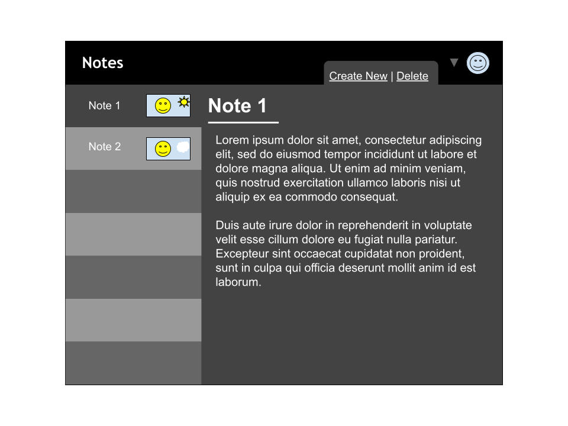

# Functional Requirements
1. The user should be able to create a profile.
2. The user should be able to edit their profile
3. The user must be able to log in to their account
4. The application must be able to generate images as covers for individual notes using Together API
5. requirement
6. requirement
7. requirement
8. requirement
9. requirement
10. requirement
11. requirement
12. requirement
13. requirement
14. requirement

# UI Mockup

# Non-functional Requirements
1. The website must work on Google Chrome
2. Multilingual support

# Use Case Descriptions

## Requirement 1
Name: The user should be able to create a profile

Actors: User, Website

Precondition: The user does not have an account and is at the landing page of the website

Trigger: The user clicks on “Create Account” button

Primary Sequence:
1. Website redirects to the user to a form to create a new account
2. The user inputs all necessary information
3. The user clicks on the “Create Account” button
4. The website creates the user and stores them in the database
5. The user is redirected to to the landing page and is able to log in

Primary Postconditions:
- The user has created a new account that is stored in the website’s database

Alternative Sequence:
1. (after 3 in primary) If the user already has an account with the same email, the website displays an error message that an account has already been created with the same email.

Alternative Postconditions:
- A new account is not created

## Requirement 2

Name: The user should be able to edit their profile

Actors: User, Website

Precondition: The user is logged in to their account and has navigated to the profile section.

Trigger: The user clicks “Edit Account Information”

Primary Sequence:
1. The website redirects the user to a page where they can edit all the information on their account (they are unable to edit their email address)
2. The user makes changes to their account information.
3. The user clicks “Apply Changes” button
4. The website updates the user’s information in the database and then redirects the user back to the profile section

Primary Postconditions:
- The user’s account information has been updated

Alternative Sequence:
1. (after 2 in primary) If the user instead selects the “Discard Changes” button, then the website doesn’t make any updates and redirects the user back to the profile section.

Alternative Postconditions:
- The user’s account is not updated

## Requirement 3
Name: The user must be able to log in to their account

Actors: User, Website

Precondition: The user has already created an account on the website.

Trigger: The user has navigated to the landing page and is not logged in.

Primary Sequence:
1. The user inputs their email address and password into the email address and passwords field correctly
2. The user clicks on the “LogIn” button
3. The website checks the email address and password and sees that it is a valid account, it then logs the user in and redirects the user to the home page.

Primary Postconditions:
- The user has been logged into their account

Alternative Sequence:
1. (after 2 in primary) The information entered in either the email address field or password field is invalid
2. The website checks and sees that the information is invalid.
3. The website displays an error message that the information is invalid.

Alternative Postconditions:
- The user is not logged in

## Requirement 4

Name: The application must be able to generate images as covers for individual notes using Together API

Actors: User, Website

Precondition: The user has already registered an account, is logged in, and has created a note with text inside of it.

Trigger: The user clicks on the “Generate Cover” button when editing a note.

Primary Sequence:
1. The website takes all the text on the note and then generates and generates an image related to some of the information in the text.
2. The note should now have a new image next to it’s name in the notes gallery

Primary Postconditions
- The user has successfully generated a cover image for the note.

Alternative Sequence:
1. (at 1 in primary) The note has no text on it
2. The website displays an error message that no image can be generated without any text for context.

Alternative Postconditions:
- The note has no new cover image.

